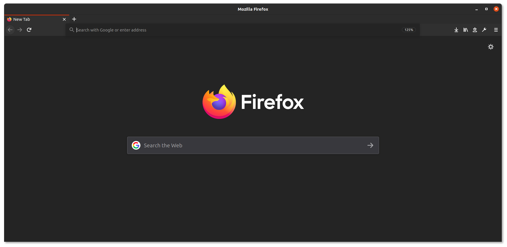

# Yaru Dark Matte for Firefox
A firefox theme adaptation of [Ubuntu Yaru dark](https://github.com/ubuntu/yaru) variation imbued with matte accent, and a subtle minimalism. The theme will be updated if the colors break when Ubuntu pushes new update to Yaru theme. 

## Install

## Screenshot

## Primary Colors

Each color is picked and matte-yfied to adapt with Yaru dark theme.

| Color | Hex code | Used for |
|-------|----------|-----------|
| Full brightness in a minecraft | `#2c2c2c`| Header |
| Nero | `#242424`| New tab |
| Tenne | `#d85600`| Accent |
| Fuchsia | `#b457ac`| Flash |